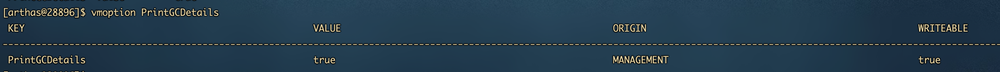
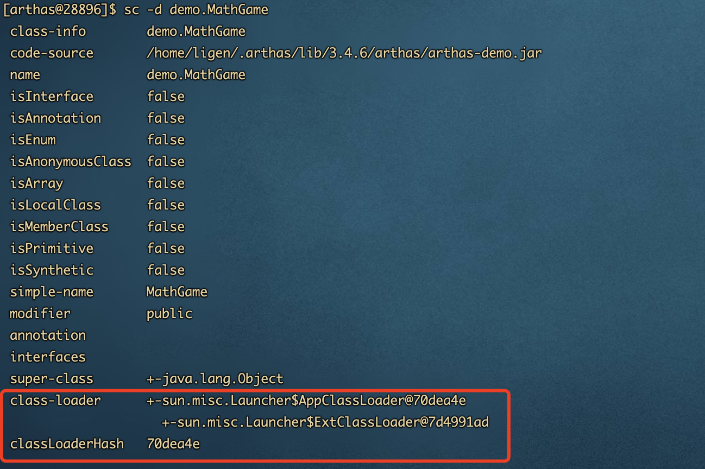

[TOC]

# 1. dashboard 仪表盘

## 1.1 作用

显示当前系统的实时数据面板，按q或ctrl + c 退出

## 1.2 效果

```sh
[arthas@32554]$ dashboard
```


## 1.3 数据说明

* ID：Java级别的线程ID，注意这个ID不能跟jstack中的nativeID 对应。
* NAME：线程名。
* GROUP：线程组名。
* PRIORITY：线程优先级，1~10之间的数字，越大代表级别越高。
* STATE：线程的状态。
* CPU%：线程消耗的CPU占比，采样100ms，将所有线程在这100ms内的cpu使用量求和，再算出每个线程的cpu使用占比。
* TIME：线程运行总时间，数据格式为`分：秒`
* INTERUPTED：线程当前的中断位状态
* DEAMON：是否是daemon线程

# 2. thread 线程相关命令

## 2.1 作用

查看当前JVM的线程堆栈信息

## 2.2 参数说明

| 参数名称    | 参数说明                              |
| ----------- | ------------------------------------- |
| 数字        | 线程id                                |
| [n <value>] | 指定最忙的前N个线程并打印堆栈         |
| [b]         | 找出当前阻塞其他线程的线程            |
| [i <value>] | 指定cpu占比统计的采样间隔，单位为毫秒 |

## 2.3 举例

```sh
# 展示当前最忙的前三个线程并打印堆栈
thread -n 3
```


```sh
# 找出当前阻塞其他线程的线程
thread -b
```


```sh
# 找到1000ms内最繁忙的前三个线程并打印
thread -i 1000 -n 3
```


```sh
# 查看处于等待状态的线程
thread --state WAITING
```


# 3. jvm

## 3.1 作用

查看当前JVM的信息

## 3.2 效果

```sh
[arthas@32554]$ jvm
```


## 3.3 jvm命令中thread相关

- COUNT: JVM当前活跃的线程数
- DAEMON-COUNT: JVM当前活跃的守护线程数
- PEAK-COUNT: 从JVM启动开始曾经活着的最大线程数
- STARTED-COUNT: 从JVM启动开始总共启动过的线程次数
- DEADLOCK-COUNT: JVM当前死锁的线程数

# 4. sysprop

## 4.1 作用

查看当前JVM的系统属性(`System Property`)

## 4.2 使用方式

1. 查看所有属性

   ```sh
   [arthas@32554]$ sysprop
    KEY                                           VALUE                                                                                                                                                                                  
   --------------------------------------------------------------------------------------------------------------------------------------------------------------------------------------------------------------------------------------
    awt.toolkit                                   sun.awt.X11.XToolkit                                                                                                                                                                   
    file.encoding.pkg                             sun.io                                                                                                                                                                                 
    java.specification.version                    1.8                                                                                                                                                                                    
    sun.cpu.isalist                                                                                                                                                                                                                      
    sun.jnu.encoding                              UTF-8                                                                                                                                                                                  
    java.class.path                               arthas-demo.jar                                                                                                                                                                        
    java.vm.vendor                                Oracle Corporation                                                                                                                                                                     
    sun.arch.data.model                           64                                                                                                                                                                                     
    java.vendor.url                               http://java.oracle.com/                                                                                                                                                                
    user.timezone                                 Asia/Shanghai                                                                                                                                                                          
    os.name                                       Linux                                                                                                                                                                                  
    java.vm.specification.version                 1.8                                                                                                                                                                                    
    user.country                                  CN                                                                                                                                                                                     
    sun.java.launcher                             SUN_STANDARD                                                                                                                                                                           
    sun.boot.library.path                         /usr/java/jdk1.8.0_271-amd64/jre/lib/amd64                                                                                                                                             
    sun.java.command                              arthas-demo.jar                                                                                                                                                                        
    sun.cpu.endian                                little                                                                                                                                                                                 
    user.home                                     /home/ligen                                                                                                                                                                            
    user.language                                 zh                                                                                                                                                                                     
    java.specification.vendor                     Oracle Corporation                                                                                                                                                                     
    java.home                                     /usr/java/jdk1.8.0_271-amd64/jre                                                                                                                                                       
    file.separator                                /                                                                                                                                                                                      
    line.separator   
    ......
   ```

2. 查看单个属性

   ```sh
   [arthas@32554]$ sysprop user.country 
    KEY                                           VALUE                                                                                                                                                                                  
   --------------------------------------------------------------------------------------------------------------------------------------------------------------------------------------------------------------------------------------
    user.country                                  CN            
   ```

3. 修改单个属性

   ```sh
   [arthas@32554]$ sysprop user.country US
   Successfully changed the system property.
    KEY                                           VALUE                                                                                                                                                                                  
   --------------------------------------------------------------------------------------------------------------------------------------------------------------------------------------------------------------------------------------
    user.country                                  US                
   ```

# 5. sysenv

## 5.1 作用

查看当前JVM的环境属性(`System Environment Variables`)

## 5.2 使用方式

1. 查看所有环境变量

   ```sh
   [arthas@32554]$ sysenv
    KEY                                           VALUE                                                                                                                                                                                  
   --------------------------------------------------------------------------------------------------------------------------------------------------------------------------------------------------------------------------------------
    PATH                                          /usr/lib64/ccache:/usr/local/bin:/usr/bin:/usr/local/sbin:/usr/sbin:/home/jiangwe/gopack/bin:/usr/java/latest/bin:/usr/java/latest/jre/bin:/mnt/apache-maven-3.6.3/bin:/home/jiangwe/m 
                                                  ongodb/bin:/home/ligen/.local/bin:/home/ligen/bin                                                                                                                                      
    HISTCONTROL                                   ignoredups                                                                                                                                                                             
    HISTSIZE                                      1000                                                                                                                                                                                   
    JAVA_HOME                                     /usr/java/latest                                                                                                                                                                       
    TERM                                          xterm                                                                                                                                                                                  
    LANG                                          zh_CN.UTF-8                                                                                                                                                                            
    XDG_SESSION_ID                                914                                                                                                                                                                                    
    SELINUX_LEVEL_REQUESTED                                                                                                                                                                                                              
    SELINUX_ROLE_REQUESTED                                                                                                                                                                                                               
    MAIL                                          /var/spool/mail/ligen                                                                                                                                                                  
    LOGNAME                                       ligen                                                                                                                                                                                  
    PWD                                           /home/ligen/.arthas/lib/3.4.6/arthas                                                                                                                                                   
    _                                             /usr/bin/java                                                                                                                                                                          
    LESSOPEN                                      ||/usr/bin/lesspipe.sh %s                                                                                                                                                              
    SHELL                                         /bin/bash                                                                                                                                                                              
    SELINUX_USE_CURRENT_RANGE                                                                                                                                                                                                            
    SSH_TTY                                       /dev/pts/2                                                                                                                                                                             
    SSH_CLIENT                                    10.8.0.4 60576 22                                                                                                                                                                      
    OLDPWD                                        /home/ligen                                                                                                                                                                            
    GOPATH                                        /home/jiangwe/gopack                                                                                                                                                                   
    USER                                          ligen                                                                                                                                                                                  
    JAVA_JRE                                      /usr/java/latest/jre                                                                                                                                                                   
    SSH_CONNECTION                                10.8.0.4 60576 10.8.0.3 22                                                                                                                                                             
    HOSTNAME                                      center_server                                                                                                                                                                          
    M2_HOME                                       /mnt/apache-maven-3.6.3                                                                                                                                                                
    XDG_RUNTIME_DIR                               /run/user/1001                                                                                                                                                                         
    HOME                                          /home/ligen                                                                                                                                                                            
    SHLVL                                         1                                                            
   ```

2. 查看单个环境变量

   ```sh
   [arthas@32554]$ sysenv USER
    KEY                                           VALUE                                                                                                                                                                                  
   --------------------------------------------------------------------------------------------------------------------------------------------------------------------------------------------------------------------------------------
    USER                                          ligen                                                                                                                                                                                  
   
   ```

# 6. vmoption

## 6.1 作用

查看，更新VM诊断相关的参数

## 6.2 使用方式

1. 查看所有的虚拟机option

   ```sh
   [arthas@28896]$ vmoption
   ```

   ​	

2. 查看指定的option

   ```sh
   [arthas@28896]$ vmoption PrintGCDetails 
   ```

   ​	

3. 更新指定的option

   ```sh
   #将打印垃圾回收详细信息的值更新为true
   [arthas@28896]$ vmoption PrintGCDetails true
   ```

   

   查看更新结果

   ​	

# 7. getstatic

## 7.1 作用

通过getstatic命令可以方便的查看类的静态属性。（推荐使用ognl语法替代）

## 7.2 使用方式

1. getstatic 类名 属性名

   可以返回

   ```sh
   [arthas@28896]$ getstatic demo.MathGame random
   field: random  #静态属性名
   @Random[       #静态属性中的参数信息
       serialVersionUID=@Long[3905348978240129619],
       seed=@AtomicLong[189071598934274],
       multiplier=@Long[25214903917],
       addend=@Long[11],
       mask=@Long[281474976710655],
       DOUBLE_UNIT=@Double[1.1102230246251565E-16],
       BadBound=@String[bound must be positive],
       BadRange=@String[bound must be greater than origin],
       BadSize=@String[size must be non-negative],
       seedUniquifier=@AtomicLong[3620162808252824828],
       nextNextGaussian=@Double[0.0],
       haveNextNextGaussian=@Boolean[false],
       serialPersistentFields=@ObjectStreamField[][isEmpty=false;size=3],
       unsafe=@Unsafe[sun.misc.Unsafe@5e07aa3c],
       seedOffset=@Long[24],
   ]
   Affect(row-cnt:1) cost in 10 ms.
   ```

2. 指定classLoader

   注意hashcode是变化的，需要先查看当前的ClassLoader信息，使用`sc -d <ClassName>`提取对应ClassLoader的hashcode。

   ​	

   使用`-c`，来查看静态变量信息

   ```sh
   [arthas@28896]$ getstatic -c 70dea4e demo.MathGame random
   #显示结果同 getstatic 类名 变量名
   ```

3. 对于只有唯一实例的ClassLoader可以通过`--classLoaderClass`指定class name，使用起来更加方便

   ```sh
   [arthas@28896]$ getstatic --classLoaderClass sun.misc.Launcher$AppClassLoader demo.MathGame random
   #显示结果同 getstatic 类名 变量名
   ```

   * 注: 这里classLoaderClass 在 java 8 是 `sun.misc.Launcher$AppClassLoader`，而java 11的classloader是`jdk.internal.loader.ClassLoaders$AppClassLoader`，katacoda目前环境是java8。

# 8. ongl

## 8.1 作用

执行ognl表达式，实现一些复杂操作

## 8.2 使用参考

- OGNL特殊用法请参考：https://github.com/alibaba/arthas/issues/71
- OGNL表达式官方指南：https://commons.apache.org/proper/commons-ognl/language-guide.html

## 8.3 使用方式

1. 调用静态函数

   ```sh
   [arthas@28896]$ ognl '@java.lang.System@out.println("hello")'
   null
   ```

   

2. 获取静态类的静态字段：

   ```sh
   [arthas@28896]$ ognl '@demo.MathGame@random'
   @Random[
       serialVersionUID=@Long[3905348978240129619],
       seed=@AtomicLong[129118463827641],
       multiplier=@Long[25214903917],
       addend=@Long[11],
       mask=@Long[281474976710655],
       DOUBLE_UNIT=@Double[1.1102230246251565E-16],
       BadBound=@String[bound must be positive],
       BadRange=@String[bound must be greater than origin],
       BadSize=@String[size must be non-negative],
       seedUniquifier=@AtomicLong[3620162808252824828],
       nextNextGaussian=@Double[0.0],
       haveNextNextGaussian=@Boolean[false],
       serialPersistentFields=@ObjectStreamField[][isEmpty=false;size=3],
       unsafe=@Unsafe[sun.misc.Unsafe@5e07aa3c],
       seedOffset=@Long[24],
   ]
   
   ```

3. 执行多行表达式，赋值给临时变量，返回一个List

   ```sh
   [arthas@28896]$ ognl '#value1=@System@getProperty("java.home"), #value2=@System@getProperty("java.runtime.name"), {#value1, #value2}'
   
   @ArrayList[
       @String[/usr/java/jdk1.8.0_271-amd64/jre],
       @String[Java(TM) SE Runtime Environment],
   ]
   ```

   