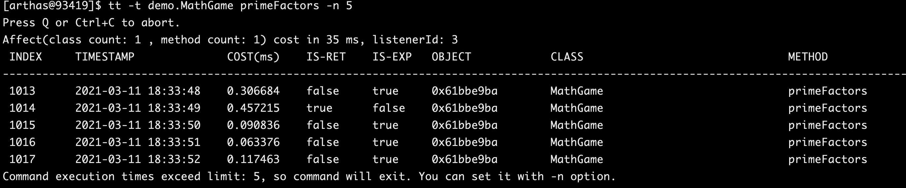

[TOC]

# 1 monitor

## 1.1 作用

> 方法执行监控

对匹配 `class-pattern`／`method-pattern`／`condition-express`的类、方法的调用进行监控。

`monitor` 命令是一个非实时返回命令.

实时返回命令是输入之后立即返回，而非实时返回的命令，则是不断的等待目标 Java 进程返回信息，直到用户输入 `Ctrl+C` 为止。

## 1.2 参数说明

方法拥有一个命名参数 `[c:]`，意思是统计周期（cycle of output），拥有一个整型的参数值

| 参数名称            | 参数说明                                |
| ------------------- | --------------------------------------- |
| *class-pattern*     | 类名表达式匹配                          |
| *method-pattern*    | 方法名表达式匹配                        |
| *condition-express* | 条件表达式                              |
| [E]                 | 开启正则表达式匹配，默认为通配符匹配    |
| `[c:]`              | 统计周期，默认值为120秒                 |
| [b]                 | 在**方法调用之前**计算condition-express |

## 1.3 监控的参数说明

| 监控项    | 说明                       |
| --------- | -------------------------- |
| timestamp | 时间戳                     |
| class     | Java类                     |
| method    | 方法（构造方法、普通方法） |
| total     | 调用次数                   |
| success   | 成功次数                   |
| fail      | 失败次数                   |
| rt        | 平均RT                     |
| fail-rate | 失败率                     |

## 1.4 使用示例

1. 查看一个方法的执行情况

   ```sh
   [arthas@3680]$ monitor -c 5 demo.MathGame primeFactors
   ```

   ​	

# 2 watch

## 2.1 作用

> 方法执行数据观测

让你能方便的观察到指定方法的调用情况。能观察到的范围为：`返回值`、`抛出异常`、`入参`，通过编写 OGNL 表达式进行对应变量的查看。

## 2.2 参数说明

watch 的参数比较多，主要是因为它能在 4 个不同的场景观察对象

| 参数名称            | 参数说明                                   |
| ------------------- | ------------------------------------------ |
| *class-pattern*     | 类名表达式匹配                             |
| *method-pattern*    | 方法名表达式匹配                           |
| *express*           | 观察表达式                                 |
| *condition-express* | 条件表达式                                 |
| [b]                 | 在**方法调用之前**观察                     |
| [e]                 | 在**方法异常之后**观察                     |
| [s]                 | 在**方法返回之后**观察                     |
| [f]                 | 在**方法结束之后**(正常返回和异常返回)观察 |
| [E]                 | 开启正则表达式匹配，默认为通配符匹配       |
| [x:]                | 指定输出结果的属性遍历深度，默认为 1       |

**特别说明**：

- watch 命令定义了4个观察事件点，即 `-b` 方法调用前，`-e` 方法异常后，`-s` 方法返回后，`-f` 方法结束后
- 4个观察事件点 `-b`、`-e`、`-s` 默认关闭，`-f` 默认打开，当指定观察点被打开后，在相应事件点会对观察表达式进行求值并输出
- 这里要注意`方法入参`和`方法出参`的区别，有可能在中间被修改导致前后不一致，除了 `-b` 事件点 `params` 代表方法入参外，其余事件都代表方法出参
- 当使用 `-b` 时，由于观察事件点是在方法调用前，此时返回值或异常均不存在

## 2.3 使用示例

1. 查看方法的入参和返回值, 每一秒执行一次.

   ```sh
   [arthas@3680]$ watch demo.MathGame primeFactors "{params,returnObj}" -x 2
   Press Ctrl+C to abort.
   Affect(class-cnt:1 , method-cnt:1) cost in 44 ms.
   ts=2018-12-03 19:16:51; [cost=1.280502ms] result=@ArrayList[
       @Object[][
           @Integer[535629513],
       ],
       @ArrayList[
           @Integer[3],
           @Integer[19],
           @Integer[191],
           @Integer[49199],
       ],
   ]
   ```

2. 观察方法入参，加上-b，在方法执行之前，因此看不到返回值

   ```sh
   [arthas@3680]$ watch demo.MathGame primeFactors "{params,returnObj}" -x 2 -b
   method=demo.MathGame.primeFactors location=AtEnter
   ts=2021-03-09 15:00:56; [cost=0.018089ms] result=@ArrayList[
       @Object[][
           @Integer[106314],
       ],
       null,
   ]
   
   ```

3. 同时观察方法调用前和方法返回后，`-n`表示执行次数

   ```sh
   [arthas@3680]$ watch demo.MathGame primeFactors "{params,target,returnObj}" -x 2 -b -s -n 2
   Press Q or Ctrl+C to abort.
   Affect(class count: 1 , method count: 1) cost in 37 ms, listenerId: 9
   method=demo.MathGame.primeFactors location=AtEnter
   ts=2021-03-09 15:04:17; [cost=0.058248ms] result=@ArrayList[
       @Object[][
           @Integer[7340],
       ],
       @MathGame[
           random=@Random[java.util.Random@254989ff],
           illegalArgumentCount=@Integer[2338],
       ],
       null,
   ]
   method=demo.MathGame.primeFactors location=AtExit
   ts=2021-03-09 15:04:17; [cost=1.00187289913506E8ms] result=@ArrayList[
       @Object[][
           @Integer[7340],
       ],
       @MathGame[
           random=@Random[java.util.Random@254989ff],
           illegalArgumentCount=@Integer[2338],
       ],
       @ArrayList[
           @Integer[2],
           @Integer[2],
           @Integer[5],
           @Integer[367],
       ],
   ]
   Command execution times exceed limit: 2, so command will exit. You can set it with -n option.
   ```

4. 调整`-x`的值，观察具体的方法参数值

   `target`代表当前对象.

   ```sh
   [arthas@3680]$ watch demo.MathGame primeFactors "{params,target}" -x 3
   Press Q or Ctrl+C to abort.
   Affect(class count: 1 , method count: 1) cost in 24 ms, listenerId: 10
   method=demo.MathGame.primeFactors location=AtExit
   ts=2021-03-09 15:09:55; [cost=0.142756ms] result=@ArrayList[
       @Object[][
           @Integer[1],
       ],
       @MathGame[
           random=@Random[
               serialVersionUID=@Long[3905348978240129619],
               seed=@AtomicLong[74401876781185],
               multiplier=@Long[25214903917],
               addend=@Long[11],
               mask=@Long[281474976710655],
               DOUBLE_UNIT=@Double[1.1102230246251565E-16],
               BadBound=@String[bound must be positive],
               BadRange=@String[bound must be greater than origin],
               BadSize=@String[size must be non-negative],
               seedUniquifier=@AtomicLong[3620162808252824828],
               nextNextGaussian=@Double[0.0],
               haveNextNextGaussian=@Boolean[false],
               serialPersistentFields=@ObjectStreamField[][isEmpty=false;size=3],
               unsafe=@Unsafe[sun.misc.Unsafe@5d099f62],
               seedOffset=@Long[24],
           ],
           illegalArgumentCount=@Integer[2492],
       ],
   ]
   method=demo.MathGame.primeFactors location=AtExit
   ```

5. 条件表达式的例子，过滤出第一个入参<0的方法调用情况

   ```sh
   [arthas@3680]$ watch demo.MathGame primeFactors "{params[0],target}" "params[0]<0"
   Press Ctrl+C to abort.
   Affect(class-cnt:1 , method-cnt:1) cost in 68 ms.
   ts=2018-12-03 19:36:04; [cost=0.530255ms] result=@ArrayList[
       @Integer[-18178089],
       @MathGame[demo.MathGame@41cf53f9],
   ]
   ```

6. 观察异常信息的例子 `-e`表示抛出异常才会显示

   ```sh
   [arthas@3680]$ watch demo.MathGame primeFactors "{params[0],throwExp}" -e -x 2
   Press Ctrl+C to abort.
   Affect(class-cnt:1 , method-cnt:1) cost in 62 ms.
   ts=2018-12-03 19:38:00; [cost=1.414993ms] result=@ArrayList[
       @Integer[-1120397038],
       java.lang.IllegalArgumentException: number is: -1120397038, need >= 2
   	at demo.MathGame.primeFactors(MathGame.java:46)
   	at demo.MathGame.run(MathGame.java:24)
   	at demo.MathGame.main(MathGame.java:16)
   ,
   ]
   ```

7. 按照耗时进行过滤，时间消耗>200 ms才会返回

   ```sh
   $ watch demo.MathGame primeFactors '{params, returnObj}' '#cost>200' -x 2
   Press Ctrl+C to abort.
   Affect(class-cnt:1 , method-cnt:1) cost in 66 ms.
   ts=2018-12-03 19:40:28; [cost=2112.168897ms] result=@ArrayList[
       @Object[][
           @Integer[2141897465],
       ],
       @ArrayList[
           @Integer[5],
           @Integer[428379493],
       ],
   ]
   
   ```

8. 观察当前对象中的属性，`target`关键字可以用于查看当前对象信息

   ```sh
   Press Ctrl+C to abort.
   Affect(class-cnt:1 , method-cnt:1) cost in 52 ms.
   ts=2018-12-03 19:41:52; [cost=0.477882ms] result=@MathGame[
       random=@Random[java.util.Random@522b408a],
       illegalArgumentCount=@Integer[13355],
   ]
   ```
   

然后使用`target.field_name`访问当前对象的某个属性

```sh
   $ watch demo.MathGame primeFactors 'target.illegalArgumentCount'
   Press Ctrl+C to abort.
   Affect(class-cnt:1 , method-cnt:1) cost in 67 ms.
   ts=2018-12-03 20:04:34; [cost=131.303498ms] result=@Integer[8]
   ts=2018-12-03 20:04:35; [cost=0.961441ms] result=@Integer[8]
```


# 3 trace

## 3.1 作用

> 方法内部调用路径，并输出方法路径上的每个节点上耗时

`trace` 命令能主动搜索 `class-pattern`／`method-pattern` 对应的方法调用路径，渲染和统计整个调用链路上的所有性能开销和追踪调用链路。

## 3.2 参数说明

| 参数名称            | 参数说明                             |
| ------------------- | ------------------------------------ |
| *class-pattern*     | 类名表达式匹配                       |
| *method-pattern*    | 方法名表达式匹配                     |
| *condition-express* | 条件表达式                           |
| [E]                 | 开启正则表达式匹配，默认为通配符匹配 |
| `[n:]`              | 命令执行次数                         |
| `#cost`             | 方法执行耗时                         |

## 3.3 使用示例

1. trace的基本使用

   ```sh
   trace com.eard.hpm.prj.domain.service.impl.ProjectRptServiceImpl projectHealthyStatusRpt
   
   
   [arthas@3680]$ trace demo.MathGame run
   Press Q or Ctrl+C to abort.
   Affect(class count: 1 , method count: 1) cost in 43 ms, listenerId: 18
   `---ts=2021-03-09 15:44:10;thread_name=main;id=1;is_daemon=false;priority=5;TCCL=sun.misc.Launcher$AppClassLoader@70dea4e
       `---[0.905289ms] demo.MathGame:run()
           `---[0.164547ms] demo.MathGame:primeFactors() #24 [throws Exception]
           
   `---ts=2021-03-09 15:44:13;thread_name=main;id=1;is_daemon=false;priority=5;TCCL=sun.misc.Launcher$AppClassLoader@70dea4e
       `---[0.242561ms] demo.MathGame:run()
           +---[0.030451ms] demo.MathGame:primeFactors() #24
           `---[0.11056ms] demo.MathGame:print() #25
   
   ```

2. trace调用次数限制

   ```sh
   [arthas@3680]$ trace demo.MathGame run -n 1
   Press Q or Ctrl+C to abort.
   Affect(class count: 1 , method count: 1) cost in 44 ms, listenerId: 19
   `---ts=2021-03-09 15:45:04;thread_name=main;id=1;is_daemon=false;priority=5;TCCL=sun.misc.Launcher$AppClassLoader@70dea4e
       `---[0.876933ms] demo.MathGame:run()
           `---[0.161823ms] demo.MathGame:primeFactors() #24 [throws Exception]
   
   Command execution times exceed limit: 1, so command will exit. You can set it with -n option.
   ```

3. 时间链路包含jdk内部函数

   `--skipJDKMethod <value> ` skip jdk method trace, default value true.

   ```sh
   [arthas@3680]$ trace --skipJDKMethod false demo.MathGame run -n 1
   Press Q or Ctrl+C to abort.
   Affect(class count: 1 , method count: 1) cost in 52 ms, listenerId: 25
   `---ts=2021-03-09 15:46:23;thread_name=main;id=1;is_daemon=false;priority=5;TCCL=sun.misc.Launcher$AppClassLoader@70dea4e
       `---[1.475546ms] demo.MathGame:run()
           +---[0.124318ms] java.util.Random:nextInt() #23
           +---[0.183613ms] demo.MathGame:primeFactors() #24 [throws Exception]
           +---[0.01313ms] java.lang.StringBuilder:<init>() #28
           +---[0.222446ms] java.lang.String:format() #57
           +---[min=0.010476ms,max=0.015714ms,total=0.02619ms,count=2] java.lang.StringBuilder:append() #57
           +---[0.023258ms] java.lang.Exception:getMessage() #57
           +---[0.012851ms] java.lang.StringBuilder:toString() #57
           `---[0.207081ms] java.io.PrintStream:println() #57
   ```

   

4. 进行耗时过滤 > 1ms

   ```sh
   [arthas@3680]$ trace demo.MathGame run '#cost > 1'
   Press Q or Ctrl+C to abort.
   Affect(class count: 1 , method count: 1) cost in 48 ms, listenerId: 29
   `---ts=2021-03-09 15:47:53;thread_name=main;id=1;is_daemon=false;priority=5;TCCL=sun.misc.Launcher$AppClassLoader@70dea4e
       `---[1.134579ms] demo.MathGame:run()
           +---[0.813866ms] demo.MathGame:primeFactors() #24
           `---[0.241652ms] demo.MathGame:print() #25
   
   ```

# 4 stack

## 4.1 作用

> 输出当前方法被调用的调用路径

很多时候我们都知道一个方法被执行，但这个方法被执行的路径非常多，或者你根本就不知道这个方法是从那里被执行了，此时你需要的是 stack 命令。

## 4.2 参数说明

| 参数名称            | 参数说明                             |
| ------------------- | ------------------------------------ |
| *class-pattern*     | 类名表达式匹配                       |
| *method-pattern*    | 方法名表达式匹配                     |
| *condition-express* | 条件表达式                           |
| [E]                 | 开启正则表达式匹配，默认为通配符匹配 |
| `[n:]`              | 执行次数限制                         |

这里重点要说明的是观察表达式，观察表达式的构成主要由 ognl 表达式组成，所以你可以这样写`"{params,returnObj}"`，只要是一个合法的 ognl 表达式，都能被正常支持。

## 4.3 使用示例

1. 查看primeFactors方法被调用的路径

   ```sh
   stack com.eard.hpm.prj.domain.service.impl.ProjectRptServiceImpl createKpiRptLine
   
   [arthas@3680]$ stack demo.MathGame primeFactors
   Press Q or Ctrl+C to abort.
   Affect(class count: 1 , method count: 1) cost in 33 ms, listenerId: 11
   ts=2021-03-09 15:30:36;thread_name=main;id=1;is_daemon=false;priority=5;TCCL=sun.misc.Launcher$AppClassLoader@70dea4e
       @demo.MathGame.primeFactors()
           at demo.MathGame.run(MathGame.java:24)
           at demo.MathGame.main(MathGame.java:16)
   ```

2. 查看入参<0的方法调用路径，仅执行两次

   ```sh
   [arthas@3680]$ stack demo.MathGame primeFactors 'params[0]<0' -n 2
   Press Q or Ctrl+C to abort.
   Affect(class count: 1 , method count: 1) cost in 39 ms, listenerId: 12
   ts=2021-03-09 15:32:52;thread_name=main;id=1;is_daemon=false;priority=5;TCCL=sun.misc.Launcher$AppClassLoader@70dea4e
       @demo.MathGame.primeFactors()
           at demo.MathGame.run(MathGame.java:24)
           at demo.MathGame.main(MathGame.java:16)
   ```

3. 根据执行时间来过滤

   ```sh
   [arthas@3680]$ stack demo.MathGame primeFactors '#cost>5'
   Press Q or Ctrl+C to abort.
   Affect(class count: 1 , method count: 1) cost in 36 ms, listenerId: 13
   ts=2021-03-09 15:34:25;thread_name=main;id=1;is_daemon=false;priority=5;TCCL=sun.misc.Launcher$AppClassLoader@70dea4e
       @demo.MathGame.primeFactors()
           at demo.MathGame.run(MathGame.java:24)
           at demo.MathGame.main(MathGame.java:16)
   ```

# 5 tt

## 5.1 作用

方法执行数据的时空隧道，记录下指定方法每次调用的入参和返回信息，并能对这些不同的时间下调用进行观测

`watch` 虽然很方便和灵活，但需要提前想清楚观察表达式的拼写，这对排查问题而言要求太高，因为很多时候我们并不清楚问题出自于何方，只能靠蛛丝马迹进行猜测。

这个时候如果能记录下当时方法调用的所有入参和返回值、抛出的异常会对整个问题的思考与判断非常有帮助。

于是乎，TimeTunnel 命令就诞生了。

## 5.2 参数说明

| tt的参数   | 说明                           |
| ---------- | ------------------------------ |
| -t         | 记录某个方法在一个时间段的调用 |
| -l         | 显示所有已经记录的列表         |
| -n  次数   | 只记录多少次                   |
| -s  表达式 | 搜索表达式                     |
| -i  索引号 | 查看指定索引号的详细调用信息   |
| -p         | 重新调用指定的索引             |

- `-t`

  tt 命令有很多个主参数，`-t` 就是其中之一。这个参数的表明希望记录下类 `*Test` 的 `print` 方法的每次执行情况。

- `-n 3`

  当你执行一个调用量不高的方法时可能你还能有足够的时间用 `CTRL+C` 中断 tt 命令记录的过程，但如果遇到调用量非常大的方法，瞬间就能将你的 JVM 内存撑爆。

  此时你可以通过 `-n` 参数指定你需要记录的次数，当达到记录次数时 Arthas 会主动中断tt命令的记录过程，避免人工操作无法停止的情况。

## 5.3 使用示例

### 5.3.1 基本使用

```sh
tt -t demo.MathGame primeFactors
# 删除全部调用记录
tt --delete-all
```

​	

- 表格字段详细说明

| 表格字段  | 字段解释                                                     |
| --------- | ------------------------------------------------------------ |
| INDEX     | 时间片段记录编号，每一个编号代表着一次调用，后续tt还有很多命令都是基于此编号指定记录操作，非常重要。 |
| TIMESTAMP | 方法执行的本机时间，记录了这个时间片段所发生的本机时间       |
| COST(ms)  | 方法执行的耗时                                               |
| IS-RET    | 方法是否以正常返回的形式结束                                 |
| IS-EXP    | 方法是否以抛异常的形式结束                                   |
| OBJECT    | 执行对象的`hashCode()`，注意，曾经有人误认为是对象在JVM中的内存地址，但很遗憾他不是。但他能帮助你简单的标记当前执行方法的类实体 |
| CLASS     | 执行的类名                                                   |
| METHOD    | 执行的方法名                                                 |

### 5.3.2 常见问题的解决

- 条件表达式

  不知道大家是否有在使用过程中遇到以下困惑

  - Arthas 似乎很难区分出重载的方法
  - 我只需要观察特定参数，但是 tt 却全部都给我记录了下来

  条件表达式也是用 `OGNL` 来编写，核心的判断对象依然是 `Advice` 对象。除了 `tt` 命令之外，`watch`、`trace`、`stack` 命令也都支持条件表达式。

- 解决方法重载

  `tt -t *Test print params.length==1`

  通过制定参数个数的形式解决不同的方法签名，如果参数个数一样，你还可以这样写

  `tt -t *Test print 'params[1] instanceof Integer'`

- 解决指定参数

  `tt -t *Test print params[0].mobile=="13989838402"`

- 构成条件表达式的 `Advice` 对象

  前边看到了很多条件表达式中，都使用了 `params[0]`，有关这个变量的介绍，请参考[表达式核心变量](https://arthas.gitee.io/advice-class.html)

### 5.3.3 限制记录调用次数

```sh
tt -t demo.MathGame primeFactors -n 5
```



### 5.3.4 查看检索调用记录

当你用 `tt` 记录了一大片的时间片段之后，你希望能从中筛选出自己需要的时间片段，这个时候你就需要对现有记录进行检索。

1. 查看全部的调用记录

   ```sh
   tt -l
   ```

   ​	

2. 按条件查找调用记录

   ```sh
   tt -s 'method.name=="primeFactors"'
   ```

   ​	

### 5.3.5 查看调用信息

对于具体一个时间片的信息而言，你可以通过 `-i` 参数后边跟着对应的 `INDEX` 编号查看到他的详细信息。

```sh
tt -i INDEX

#Example
tt -i 1007
```


### 5.3.6 重新调用一次

会重新执行一次1007这个信息，便于重现问题。

```sh
tt -i 1007 -p
```


### 5.3.7 指定重新调用的次数和时间间隔

```sh
tt -i 1007 -p --replay-times 2 --replay-interval 2000

#--replay-times 指定重新调用次数
#--replay-interval 指定时间间隔
```

