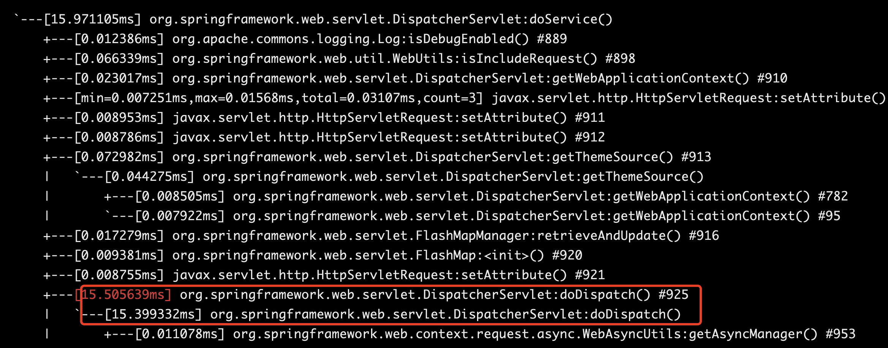
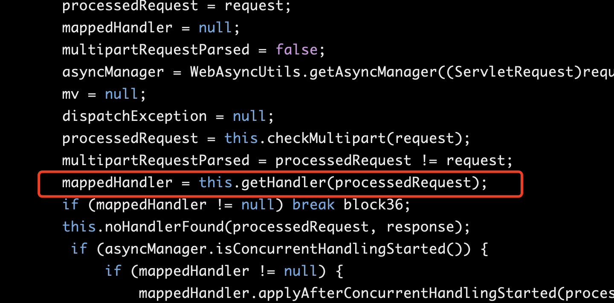

[toc]

# 使用arthas监控报错方法并修复

```shell
#下载arthas
curl -O https://arthas.aliyun.com/arthas-boot.jar
#启动arthas
java -jar arthas-boot.jar
#监控报错的方法
watch com.hand.hap.message.websocket.WebSocketSessionManager addSession "{params[0],throwExp}" -e -x 2
#查看方法源码
jad com.hand.hap.message.websocket.DefaultWebSocketHandler 
#本地编译好class文件上传到服务器,热部署
retransform /opt/tomcat/webapps/DefaultWebSocketHandler.class
#查看被增强的类
retransform -l
#删除增强内容
retransform -d 1
#退出
quit
```


# 使用arthas查找前端调用的后端api

1. 由SpringMVC基础知识可知，所有前端调用都需要经过前端控制器`DispatcherServlet`，所以先监控Spring中的`DispatcherServlet`，得到其中执行时间最长的方法。

   执行命令: 

   ```sh
   [arthas@21706]$ trace org.springframework.web.servlet.DispatcherServlet *
   ```

   返回结果:

   ​	

2. 可以看到执行最长的是`doDispatch()`，反编译`doDispatch`

   ```sh
   [arthas@21706]$ jad org.springframework.web.servlet.DispatcherServlet doDispatch
   ```

   在反编译的代码中找到SpringMVC中`DispatcherServlet`调用的下一级-处理器映射器`HandlerMapping`的生成方法，入下图

   ​	

3. 监控`getHandler`的返回值

```sh
[arthas@21706]$ watch org.springframework.web.servlet.DispatcherServlet getHandler "returnObj"

method=org.springframework.web.servlet.DispatcherServlet.getHandler location=AtExit
ts=2021-03-11 10:08:28; [cost=2.211883ms] result=@HandlerExecutionChain[
    logger=@SLF4JLocationAwareLog[org.apache.commons.logging.impl.SLF4JLocationAwareLog@112ad846],
    handler=@HandlerMethod[public org.springframework.http.ResponseEntity<io.choerodon.core.domain.Page<com.eard.hpm.prj.domain.entity.TestCellAssignment>> com.eard.hpm.prj.api.controller.v1.TestCellAssignmentController.list(java.lang.Long,com.eard.hpm.prj.domain.entity.TestCellAssignment,io.choerodon.mybatis.pagehelper.domain.PageRequest)],
    interceptors=null,
    interceptorList=@ArrayList[isEmpty=false;size=5],
    interceptorIndex=@Integer[-1],
]
```

